---
options:
  end_slide_shorthand: true
theme:
  name: light
  override:
    slide_title:
      colors:
        foreground: "001f3f"
---

<!-- jump_to_middle -->
DimSum
===

<!-- reset_layout -->


---
<!-- font_size: 2 -->

<!-- jump_to_middle -->
# What is DimSum?
<!-- pause -->
A Rocq-based framework for reasoning about multi-language programs.

---
<!-- font_size: 2 -->

<!-- jump_to_middle -->
# A Brief History of Compiler Correctness

---
<!-- font_size: 2 -->
Compiler Correctness Quiz Show
==

<!-- pause -->
## Q: What makes a compiler correct? (S=source)
<!-- pause -->
1. _S and Comp(S) are observationally equivalent_
<!-- pause -->
2. _if S has well-defined semantics, then S and Comp(S) are observationally equivalent_
<!-- pause -->
3. _if S has well-defined semantics and satisfies Spec, then Comp(C) satisfies Spec_
<!-- pause -->
4. _if S is type- and memory-safe, then so is Comp(S)_
<!-- pause -->
5. _Comp(S) is type- and memory-safe_

<!-- pause -->


---
<!-- font_size: 2 -->

Calling...
==
<!-- pause -->


<!-- pause -->
## Solution
 2. _if S has well-defined semantics, then S and Comp(S) are observationally equivalent_

---
<!-- font_size: 2 -->

CompCert: Guarantees
===

<!-- pause -->
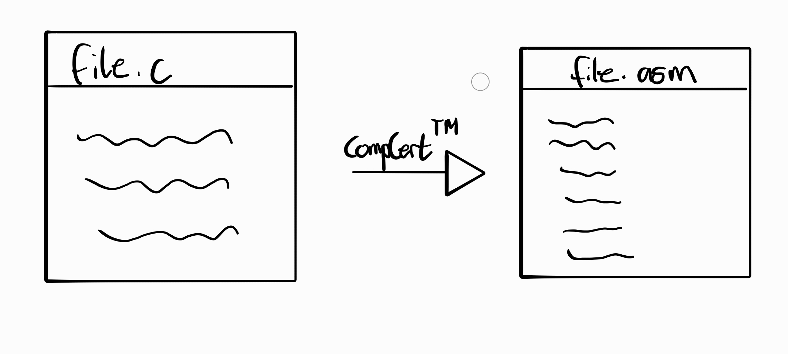

<!-- pause -->
> "file.asm behaves like file.c"

<!-- pause -->
## Formally
```typst +render
  $forall s forall B in.not "Wrong ." s arrow.b.double B => "Comp(s)" arrow.b.double B$
```
<!-- pause -->
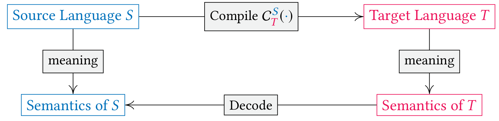

---
<!-- font_size: 2 -->

Compcert: Linking
===
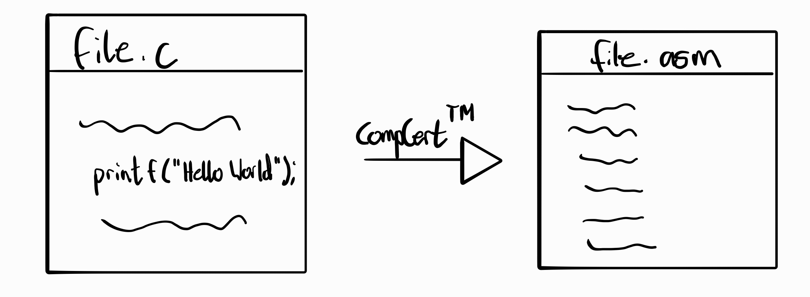

<!-- pause -->
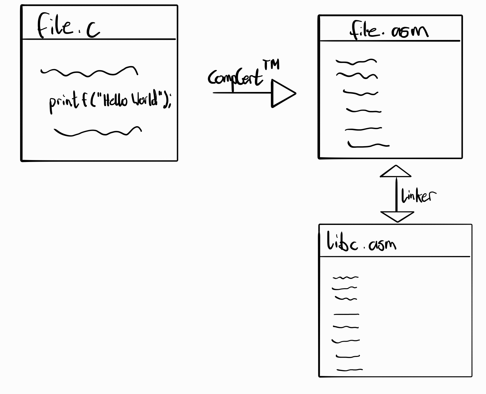

<!-- pause -->
> "if S has well-defined semantics [...]"

---
<!-- font_size: 2 -->

Compositional Compiler Correctness
===

<!-- pause -->
## Problem: How do you assign a 'reference' semantics to a partial program?

<!-- pause -->

 
<!-- pause -->
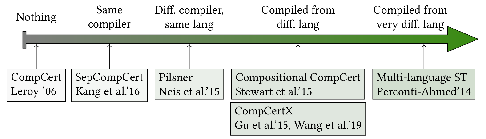


---
<!-- font_size: 2 -->

Multi-Language Semantics
===

<!-- pause -->
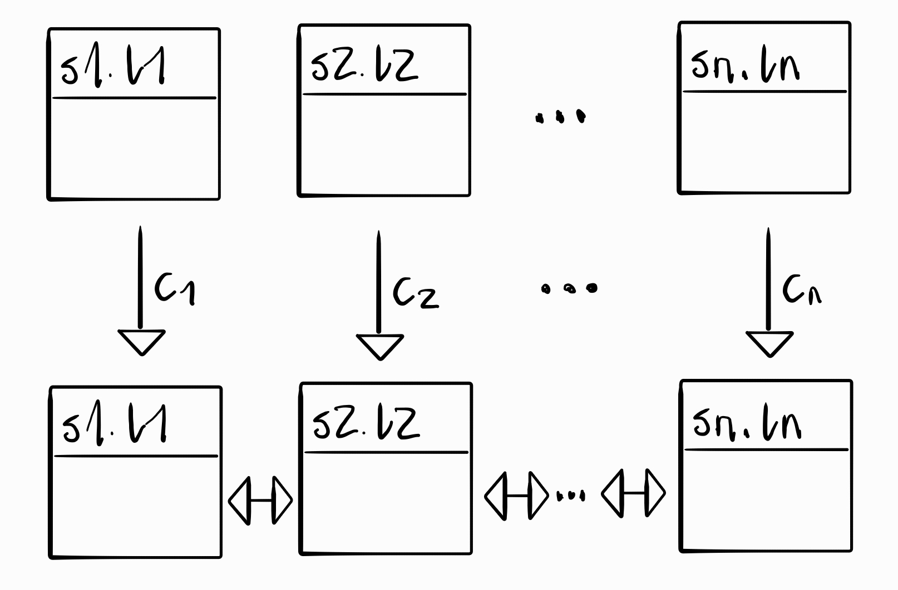

<!-- pause -->
## Formal Definition of P

<!-- pause -->
```typst +render
  $P = C_1 (S_1) union C_2 (S_2) union ... union C_n (S_n)$
```

<!-- pause -->
- What property do we want to show for P?

<!-- pause -->
## Semantic Refinement

<!-- pause -->
```typst +render
  #let sem(x) = ("" + x + "")
  $sem(P) = sem(C_1 (S_1) union C_2 (S_2) union ... union C_n (S_n))$
```

<!-- pause -->
```typst +render
  #let sem(x) = ("" + x + "")
  $prec.eq sem(S_1) xor sem(S_2) xor ... xor sem(S_n)$
```

---
<!-- font_size: 2 -->

## Semantic Refinement

```typst +render
  #let sem(x) = ("" + x + "")
  $sem(P) = sem(C_1 (S_1) union C_2 (S_2) union ... union C_n (S_n))$
```

```typst +render
  #let sem(x) = ("" + x + "")
  $prec.eq sem(S_1) xor sem(S_2) xor ... xor sem(S_n)$
```

<!-- column_layout: [1,1] -->

<!-- column: 0 -->
<!-- pause -->
### Requires:
  <!-- pause -->
  - definition of semantics
  - definition of refinement
  - composition of semantics

<!-- column: 1 -->
<!-- pause -->
### Goals:
  <!-- pause -->
  - ability to add languages
  - no assumptions about languages

<!-- reset_layout -->
<!-- pause -->
## Beyond Compiler Correctness
```typst +render
  #let sem(x) = ("" + x + "")
  $sem(P) &= sem(C_1 (S_1) union C_2 (S_2) union ... union C_n (S_n))\
  &prec.eq sem(S_1) xor sem(S_2) xor ... xor sem(S_n)$
```
<!-- pause -->
> "Compiled program adheres to the code you wrote."
<!-- pause -->
```typst +render
  #let sem(x) = ("" + x + "")
  $&prec.eq sem("Spec")$
```
<!-- pause -->
> "Compiled program adheres to semantics of some specification."

---

<!-- jump_to_middle -->
Enter DimSum
===

---
<!-- font_size: 2 -->

Does DimSum Adhere?
===

<!-- column_layout: [1,1] -->
<!-- column: 0 -->
<!-- pause -->
### Requires:
<!-- pause -->
  - <span style="color: #4f7942">definition of semantics</span>
  <!-- pause -->
  - <span style="color: #4f7942">definition of refinement</span>
  <!-- pause -->
  - <span style="color: #4f7942">composition of semantics</span>

<!-- column: 1 -->
<!-- pause -->
### Goals:
  <!-- pause -->
  - <span style="color: #4f7942">ability to add languages</span>
  <!-- pause -->
  - <span style="color: #8c3b3b">no assumptions about languages</span>

<!-- reset_layout -->
<!-- column_layout: [1,1] -->
<!-- column: 0 -->
<!-- pause -->
### Allows for:
  <!-- pause -->
  - different memory models
  - different value structures
  - different control flow structure

<!-- pause -->
<!-- column: 1 -->
### But:
  <!-- pause -->
  - no concurrency
  - no typed languages
 
---
<!-- font_size: 2 -->

Semantics in DimSum: Modules and Events
===

<!-- pause -->
## Goal
  <!-- pause -->
  - define semantics function
  ```typst +render
   $*_"L" : "Prog"_"L" -> "Semantic Domain"$
  ```
  <!-- pause -->
  - must be defined for every language separately
  <!-- pause -->
  - BUT: what should _Semantic Domain_ be?

<!-- pause -->
## Idea (1)
<!-- column_layout: [1,1] -->
<!-- column: 0 -->
  <!-- pause -->
  ```typst +render
   $*_"L" : "Prog"_"L" -> "Module"_"E"$
  ```
  <!-- pause -->
  - module: state transition system
  ```typst +render
   $M(E) = (S, ->, sigma^0)\
   -> subset.eq S times (E union.plus {tau}) times cal(P)(S)$
  ```
<!-- column: 1 -->
  <!-- pause -->
  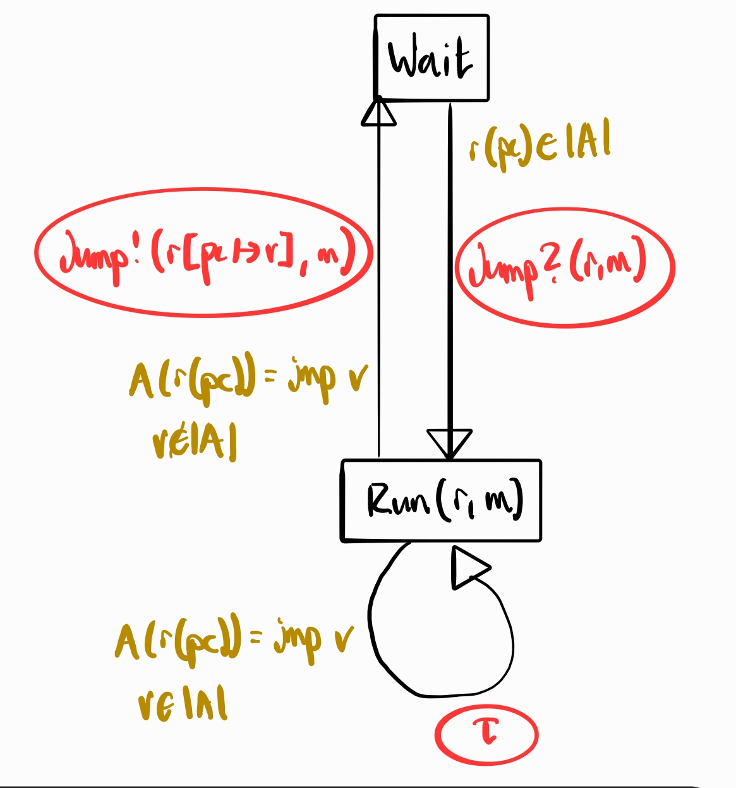
<!-- reset_layout -->


---
<!-- font_size: 2 -->

Semantic Linking: Combining Modules
===

<!-- pause -->
## Goal
  <!-- pause -->
  - combine semantic modules
  ```typst +render
    #let sem(x) = ("" + x + "")
    $sem(S_1) xor sem(S_2) xor ... xor sem(S_n)$
  ```

<!-- pause -->
## Idea (2)
<!-- column_layout: [1,1] -->
<!-- column: 0 -->
  <!-- pause -->
  - semantic linker is "runtime interpreter" over M1, M2
  ```typst +render
   $xor_"E" : "Module"_"E" -> "Module"_"E" -> "Module"_"E"$
  ```
  <!-- pause -->
  - defined by tuple
  ```typst +render
   $(S,arrow.r.squiggly, s_0)\
   arrow.r.squiggly subset.eq ({L,R,E} times S times E) times ({L,R,E} times S times (E union {crossmark.heavy}))$
  ```
  <!-- pause -->
  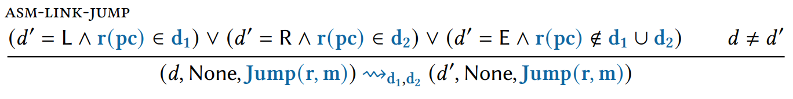
<!-- column: 1 -->
  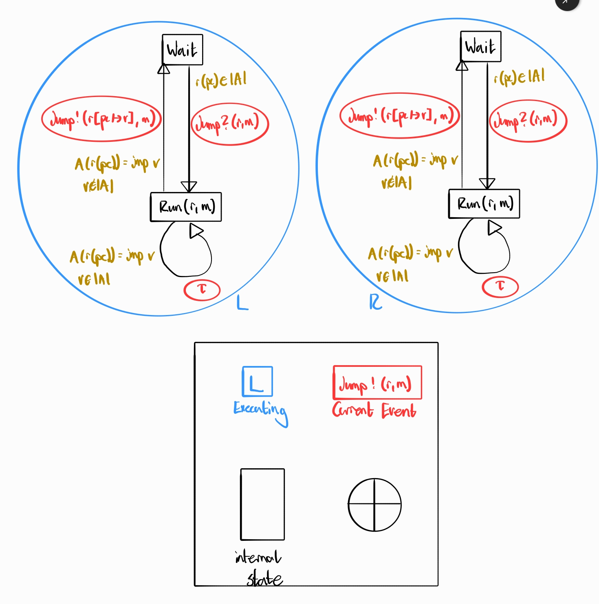
<!-- reset_layout -->


---
<!-- font_size: 2 -->

Case Study of DimSum: Rec, Asm, Spec
===
<!-- pause -->
## Rec
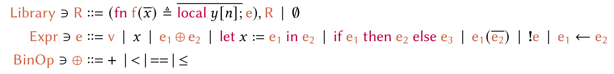

<!-- pause -->
## Assembly Language
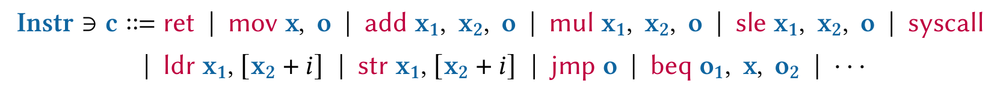

<!-- pause -->
## Mathematical Specification Language
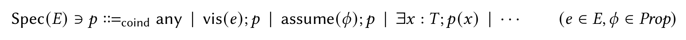


---
<!-- font_size: 2 -->

Example Code
===

- code
- (how does a module look like here?)

---
<!-- font_size: 2 -->

Proof Outline
===

- show first, second step
- wrappers

---
<!-- font_size: 2 -->

Wrappers
===

- required to reason about semantic differences between languages

---
<!-- font_size: 2 -->

Refinement
===

- simulation of one module of another
